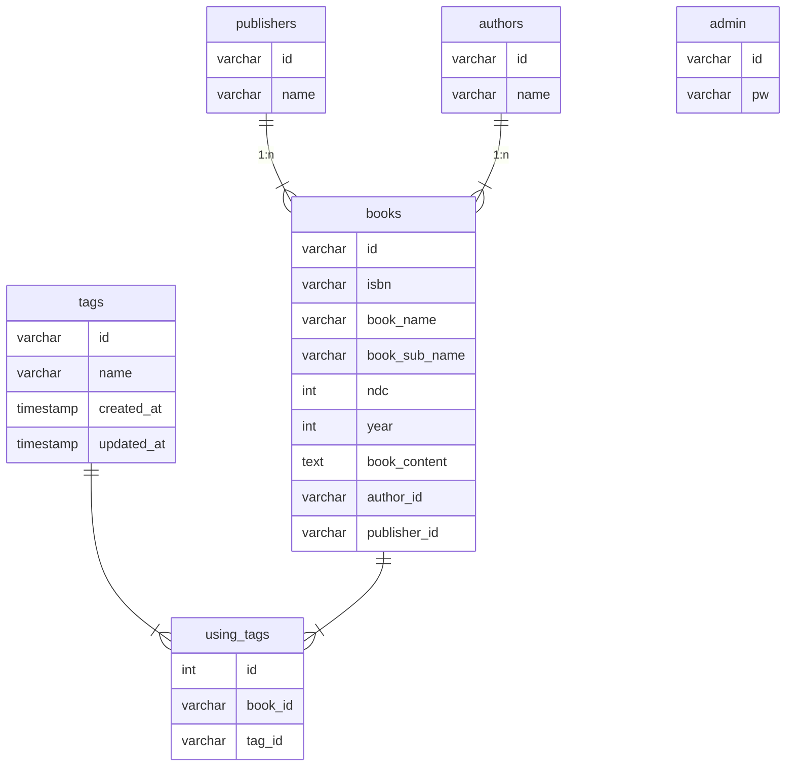

# DBのE-R図

HOTATEで用いられてるDBのE-R図です。

```mermaid
erDiagram

publishers ||--|{books: "1:n"
authors ||--|{books: "1:n"
tags ||--|{using_tags: ""
books ||--|{using_tags: ""

admin {
  varchar id
  varchar pw
}

books {
  varchar id
  varchar isbn
  varchar book_name
  varchar book_sub_name
  int ndc
  int year
  text book_content
  varchar author_id
  varchar publisher_id
}

publishers {
  varchar id
  varchar name
}

authors {
  varchar id
  varchar name
}

tags {
  varchar id
  varchar name
  timestamp created_at
  timestamp updated_at
}

using_tags {
  int id
  varchar book_id
  varchar tag_id
}
```

[SQL](https://github.com/booksearch-hotate/hotate-server/blob/main/db/init/001_createhotate.sql)
