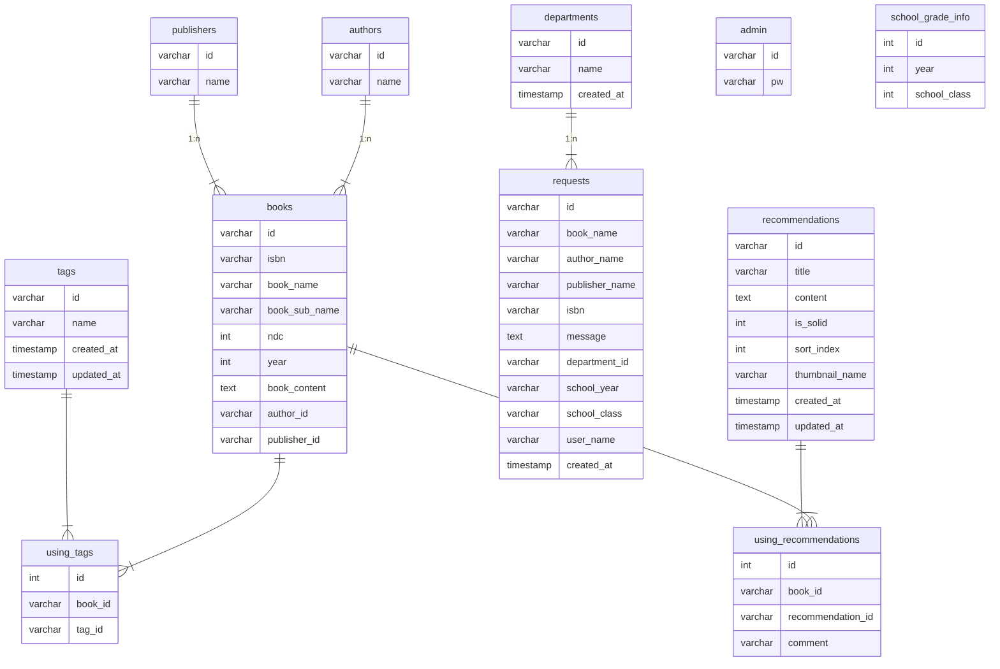

# DBのE-R図

TREEで用いられてるDBのE-R図です。(`v1.1.0`現在)

```mermaid
erDiagram

publishers ||--|{books: "1:n"
authors ||--|{books: "1:n"
tags ||--|{using_tags: ""
books ||--|{using_tags: ""
departments ||--|{requests: "1:n"
recommendations ||--|{using_recommendations: ""
books ||--|{using_recommendations: ""

admin {
  varchar id
  varchar pw
}

books {
  varchar id
  varchar isbn
  varchar book_name
  varchar book_sub_name
  int ndc
  int year
  text book_content
  varchar author_id
  varchar publisher_id
}

publishers {
  varchar id
  varchar name
}

authors {
  varchar id
  varchar name
}

tags {
  varchar id
  varchar name
  timestamp created_at
  timestamp updated_at
}

using_tags {
  int id
  varchar book_id
  varchar tag_id
}

departments {
  varchar id
  varchar name
  timestamp created_at
}

requests {
  varchar id
  varchar book_name
  varchar author_name
  varchar publisher_name
  varchar isbn
  text message
  varchar department_id
  varchar school_year
  varchar school_class
  varchar user_name
  timestamp created_at
}

recommendations {
  varchar id
  varchar title
  text content
  int is_solid
  int sort_index
  varchar thumbnail_name
  timestamp created_at
  timestamp updated_at
}

using_recommendations {
  int id
  varchar book_id
  varchar recommendation_id
  varchar comment
}

school_grade_info {
  int id
  int year
  int school_class
}
```

[SQL](https://github.com/booksearch-hotate/hotate-server/blob/main/db/init/001_createhotate.sql)
