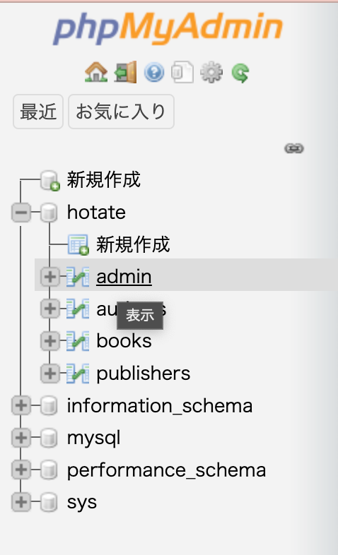
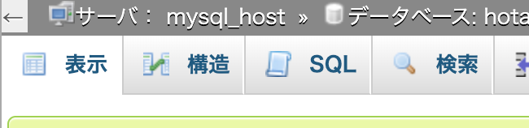
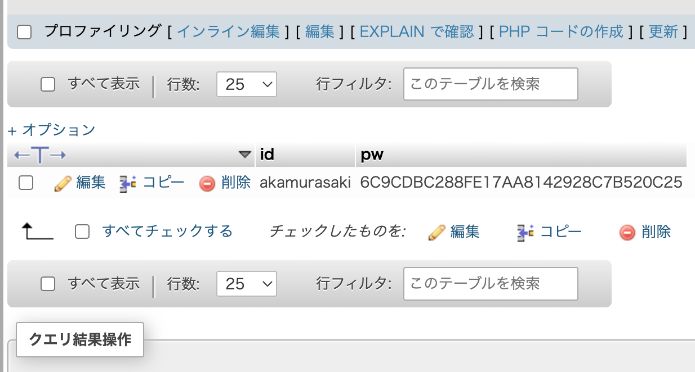

# 使い方

## アプリのソースコード取得方法

※本来は導入時に行うものですので、既にエンジニアによって導入手続きが終わっている場合は省略してください。

1. このリポジトリを`git clone`する
2. `cd ./hotate-server`を入力

## アプリの起動方法

1. docker Desktopを起動し、docker Engineを起動する
2. コマンドプロンプト（ターミナル）を開く
3. hotate-serverフォルダまで移動
4. `docker-compose up app`と入力
5. webブラウザで[http://localhost:8080](http://localhost:8080)を開く

## 個別のサービス起動方法

※ 通常ならば`docker-compose up app`で全てのサービス(Elasticsearchなど)が起動するようになっています。

1. `docker-compose up <アプリ名>`を入力

`<アプリ名>`の箇所は`docker-compose.yml`を参考にしてください。

## 管理者のIDとパスワードについて

管理者用のIDとパスワードは導入時に決めたものがありますので、それを入力してください。

### IDとパスワードの設定方法

初期のIDとパスワードを忘れた、または変更したいという場合は以下の操作を試してください。

#### 注意

この作業は少々複雑な作業となります。**このドキュメントを慎重に読んで**作業してください。

#### 方法

1. envファイルから暗号鍵を取得
	1. 「hotate-server」 > 「app」を開く
	2. 「.env」ファイルの中身を表示
		- 表示されない場合は「隠しファイルを表示する」をチェックするなどしてください
	3.「DB_PW_KEY」の値をコピーする
2. `docker-compose up mysql phpmyadmin`を入力
3. webブラウザで[http://localhost:8081](http://localhost:8081)を開く
4. 画面左側にある「hotate」 > 「admin」をクリック

5. 画面上側にある「SQL」をクリック

6. SQL文`DELETE FROM admin`を入力
7. 画面右下ら辺にある「実行」をクリック
8. `INSERT INTO admin VALUES ('<ID>', HEX(AES_ENCRYPT('<PW>', '<暗号鍵>')))`を入力
	- `<ID>`には好きなIDを、`<PW>`には好きなパスワードを、`<暗号鍵>`には先程コピーした暗号鍵をペーストしてください

このようになっていれば正しく変更できています。

